# Maven Roasters NYC: Operational Performance Audit (2023)

## Project Overview 
This project performs a comprehensive analysis of transaction data across three NYC coffee shop locations.  
The goal is to provide the regional manager with actionable insights regarding staffing optimisation, inventory velocity, and revenue trends. 

## Tools
- **SQL:** Feature engineering and Data subsetting. 
- **Python (Pandas/Seaborn):** Exploratory Data Analysis (EDA) and visualistion. 
- **Tableau:** Executive Dashboard for stakeholder presentation. 

## Initial EDA Findings (Phase 1): 
- **Data Integrity:** 100% completion rate (no missing values). 
- **Scope:** Analysis covers 01/01/2023 to 30/06/2023 
- **Structure:** Transactional data is at the Line-Item level. (Unique IDs per sold product) 

## Initial EDA Finidngs (Phase 2): 

### 1. Consistent Monthly Traffic Increase: 
Monthly transaction volume doubles from January to June, showing strong positive momentum heading into the summer season.

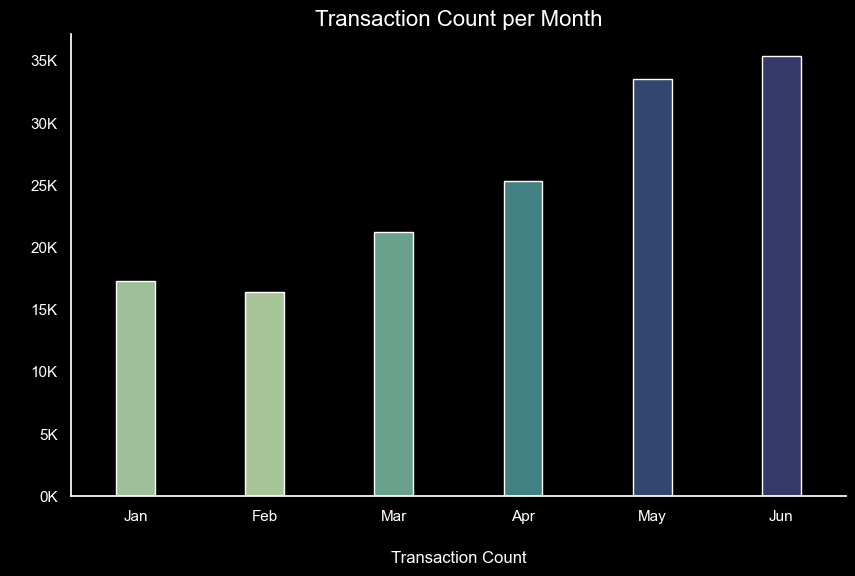

### 2. Consistent Monthly Financial Growth:

Mirroring the transaction trend, total revenue saw a sustained monthly increase, doubling from **~$80K** in January to a peak of over **~$160K** in June

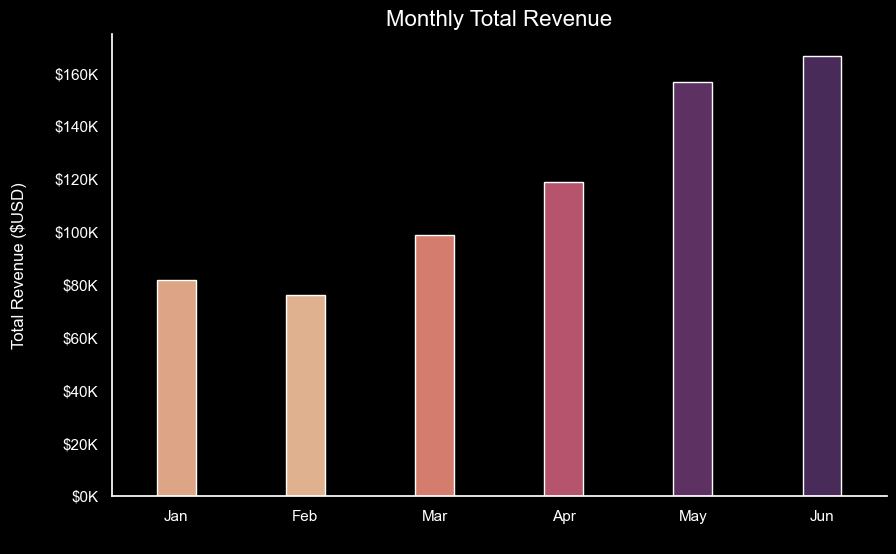

### 3. Consistent Weekly Foot Traffic: 
Daily transactions show minimal variance, peaking slightly on **Fridays** and **Mondays** while maintaining a solid floor of **~20K** even on **Saturdays**. 

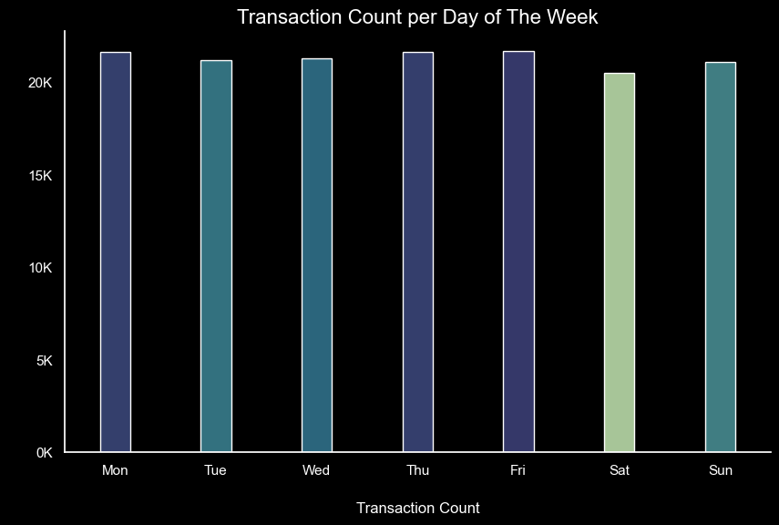

### 4. Uniform Weekly Revenue Distribution:
Revenue follows a consistent baseline across the week, mirroring the steady foot traffic observed in previous findings. The data confirms a reliable revenue stream with a minor peak on weekdays, indicating that the business successfully captures consistent demand without relying on weekend spikes.

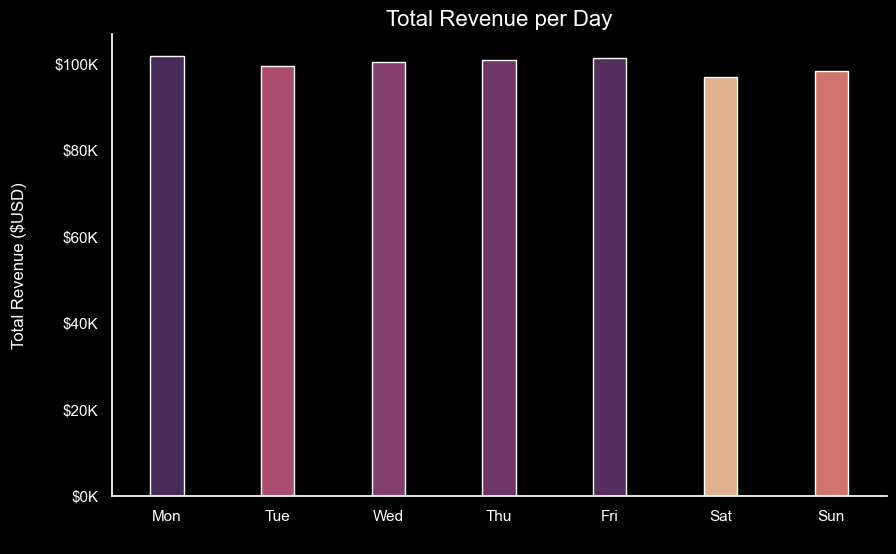

### 5. Morning Peak Dominance: 

Customer traffic is highest between **08:00** and **11:00**.  
With a notable peak of over 18K transactions at **10:00** 

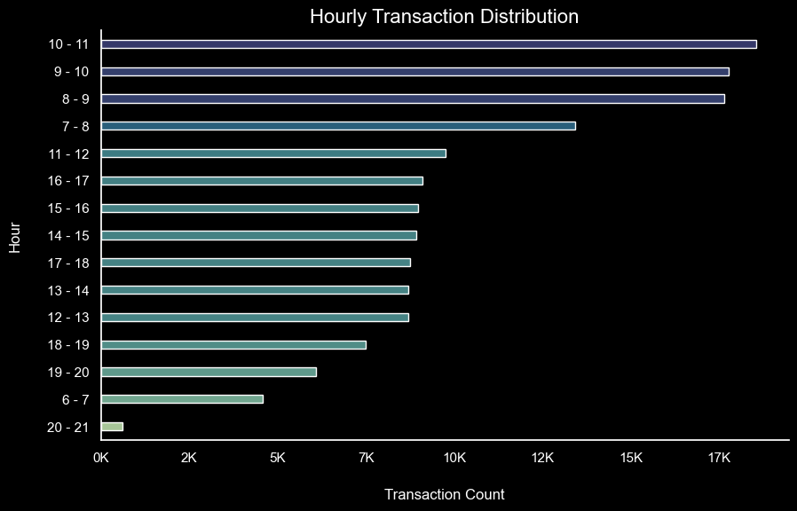

### 6. High-Value Morning Window: 

Revenue generation peaks between **08:00** and **11:00**, mirroring foot traffic and identifying the most profitable period for daily operations.

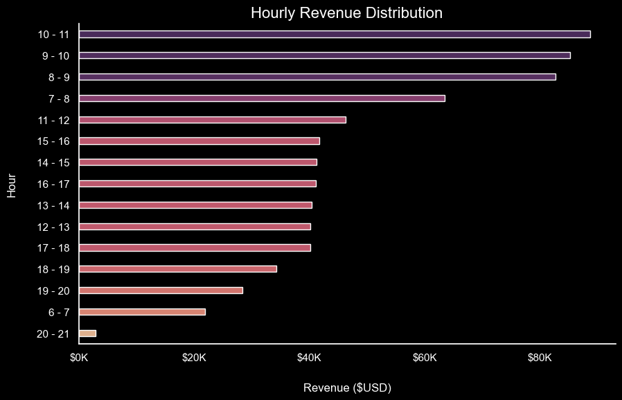

### 7. Product Category Performance by Total Units Sold:

Coffee and Tea are the undisputed volume drivers, with Coffee approaching **90K units** sold. Lower-volume categories like **Branded** and **Packaged Chocolate** represent niche segments with minimal footprint. 

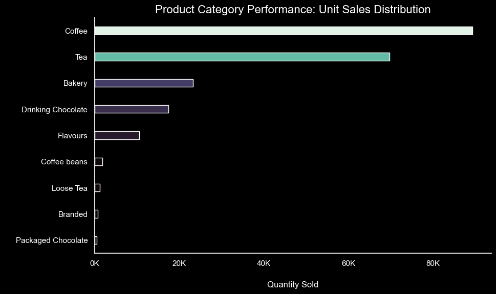

### 8. Top Performing Product Categories by Transaction Count:

Market dominance is concentrated in the **Coffee** and **Tea** categories, which combined account for over **100K unique transactions**. This confirms that the primary business driver is daily beverage consumption.

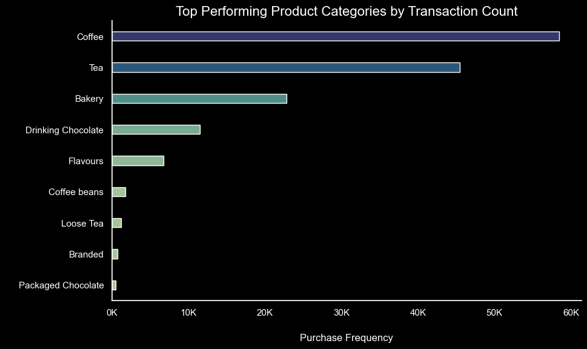

### 9. Products Revenue Generation:

**Coffee** is the primary revenue driver, contributing over **$250K**—more than double the revenue of the Bakery and Drinking Chocolate categories combined.

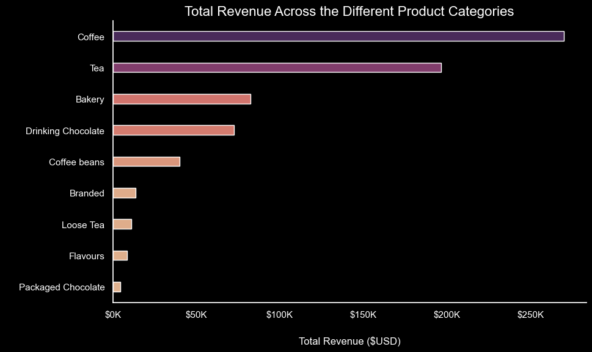

### 10. Leading Product Types by Cumulative Unit Sales: 

While beverages occupy 9 out of the top 10 slots, the **Scone** emerges as a high-volume outlier with over **10K units sold**. This indicates a significant opportunity for bundled promotions between top-tier beverages and the leading bakery item.

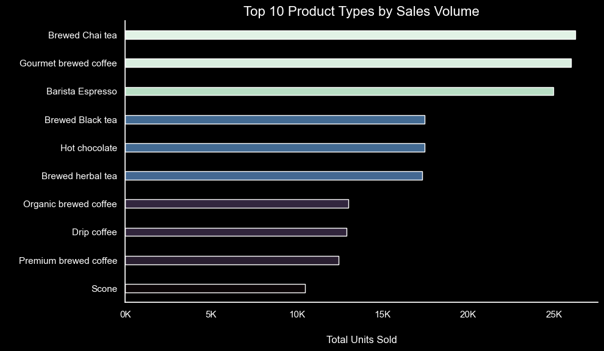

### 11. Frequency Distribution of Leading Product Types: 
Consumption habits are focused on **"Fresh-Brewed"** items, with the top three products accounting for a significant portion of total store traffic.  
The **Scone's** jump in ranking from **volume (10th)** to **frequency (7th)** highlights its role as a key "impulse" or "routine" purchase. This suggests that while it isn't bought in large quantities, it is a consistent driver of customer visits, outperforming **Premium brewed coffee** in total transaction count.

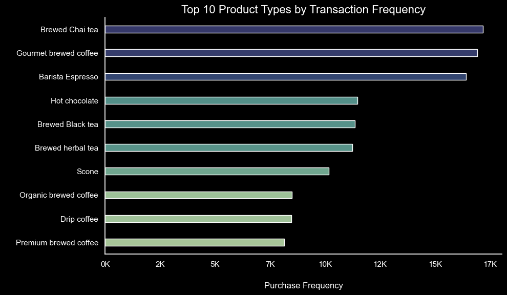

### 12. Top 10 Product Types by Total Revenue Generation
Financial leadership is anchored by **Barista Espresso**, which generates over **$90K** in total revenue.  
While **Hot Chocolate** ranks 5th in units sold and 4th in frequency, it rises to **3rd in total revenue (~$70k)**.  
This indicates a higher price-per-unit compared to high-frequency items like **Brewed Chai tea**, which leads in volume but yields lower total revenue relative to its sales velocity.

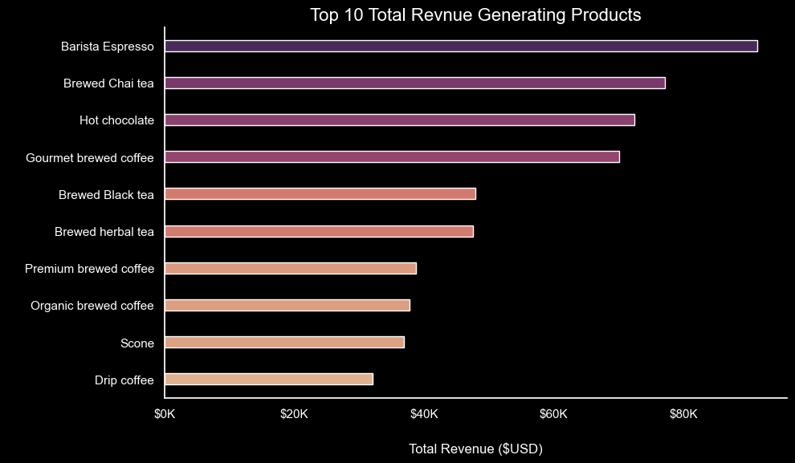

### 13. Top 10 Specific Items by Unit Sales Volume: 
The individual item leader is **Earl Grey Rg**, moving nearly **5K units**.  
While the "Tea" category leads in volume, this data reveals that demand is remarkably balanced across specific high-performing items; the gap between the top-ranked **Earl Grey Rg** and the 10th-ranked **Serenity Green Tea Rg** is less than 500 units, indicating a diverse but consistent demand for tea varieties.  
The presence of both "Regular" (Rg) and "Large" (Lg) sizes in the top 10—specifically for **Dark chocolate** and various **Lattes**—suggests that size availability is a key driver for unit volume generation within these specific product types.

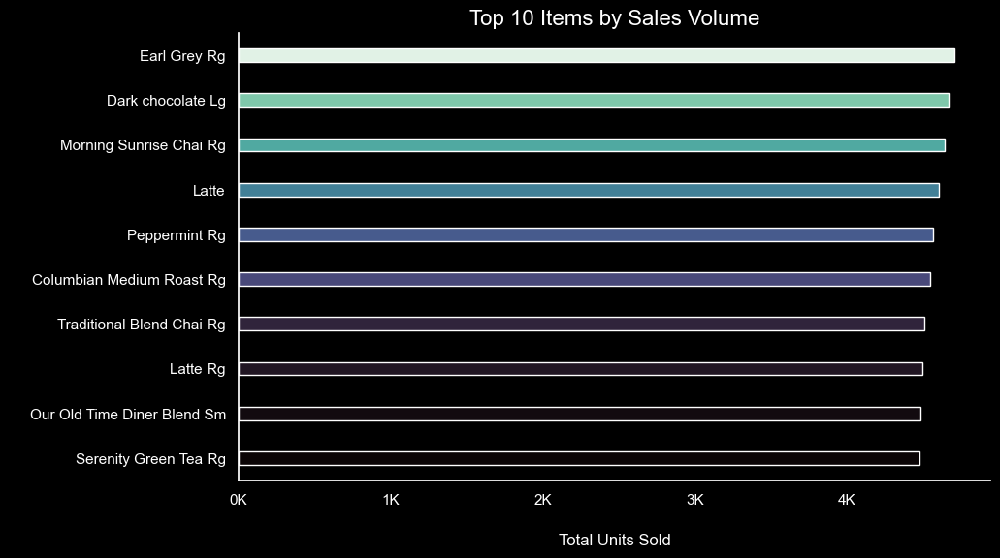

### 14. Top 10 Individual Items by Purchase Frequency: 
The **Chocolate Croissan**t emerges as the most frequently purchased individual item, recording over **3K unique transactions**.  
While "Coffee" as a category has the highest overall frequency, the individual item data shows that the **Chocolate Croissant** is a major driver of repeat foot traffic, outperforming high-volume staples like **Earl Grey Rg** and **Dark chocolate Lg** in total transaction count.

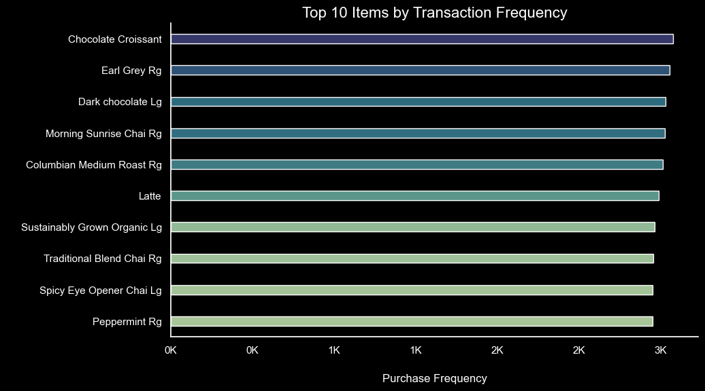

### 15. Top 10 Specific Items by Total Revenue Generation:

The top 10 revenue-generating items are led by premium specialty coffees, with a significant revenue gap between the top two performers (~$21K) and the 10th-ranked "Brazilian Lg" (~$15K). The data suggests that **premium-priced organic and specialty latte/cappuccino variants** constitute the core of company's financial success.  
Analysis of individual Stock Keep Unit (SKU) performance reveals that **"Sustainably Grown Organic Lg"** and **"Dark Chocolate Lg"** are the primary revenue drivers, both exceeding **$20K** in total sales. There is a clear trend toward "Large" format beverages and organic specialty items, which consistently outperform standard menu offerings. 

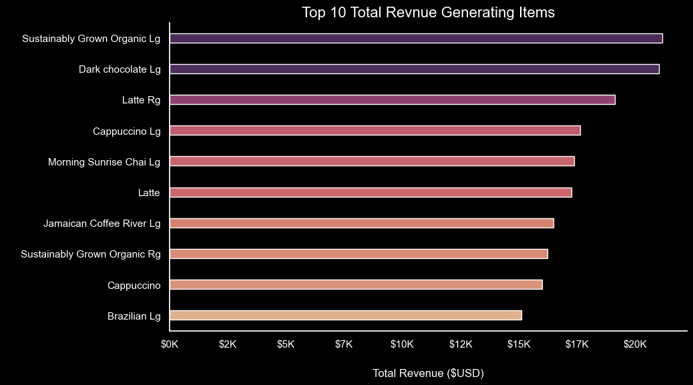

### 16. Stores' Transaction Distribution:

Transaction volume is remarkably consistent across all three New York locations, with Hell's Kitchen and Astoria leading slightly at over 50K transactions each.

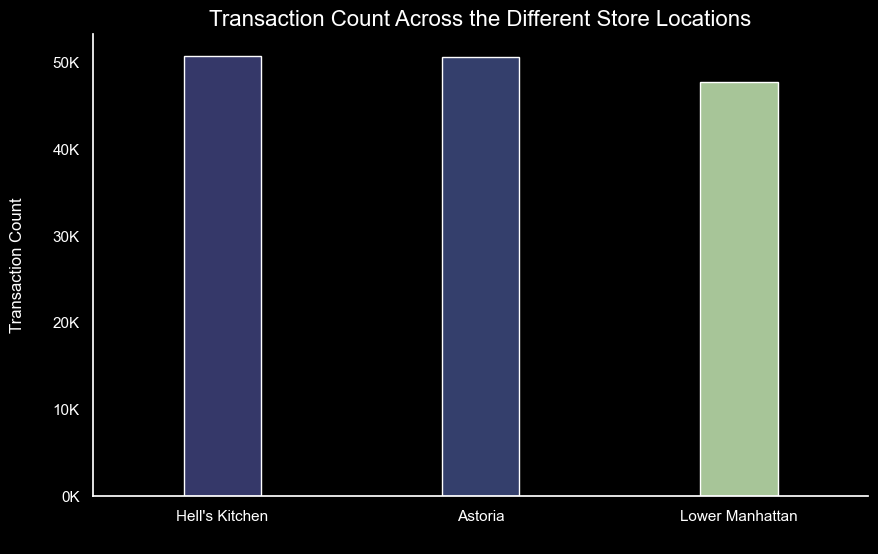

### 17. Store's Revenue Distribution: 

Total revenue is exceptionally well-balanced across all three locations, with each store contributing approximately $230K, demonstrating a consistent and scalable business model.

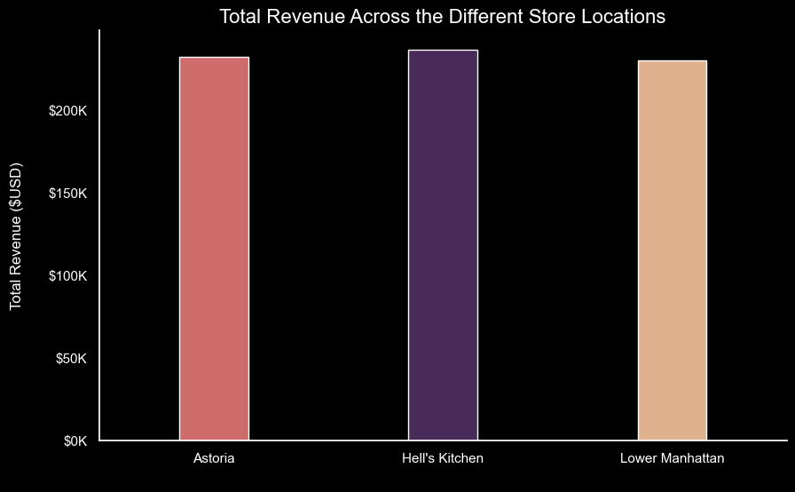

## Takeaways from EDA-Phase 2 Findings: 

### Robust Growth & Scalability

- **Aggressive Revenue Trajectory:** The chain demonstrated exceptional growth, with both monthly transaction volume and total revenue doubling between January and June.

- **Geographic Uniformity:** Revenue (~$230K/store) and transactions (~50K/store) are remarkably consistent across Astoria, Hell's Kitchen, and Lower Manhattan. This indicates a highly **standardised and scalable business model** that is not dependent on a single "star" location.

- **Predictable Daily Flow:** A stable floor of ~20K transactions even on Saturdays suggests a loyal customer base that maintains routine even outside of the standard work week.

### High-Efficiency Operational Windows: 

- **The "Golden Hours" (08:00–11:00):** This morning block is the engine of the business, peaking at 10:00 with over 18K transactions.

- **Labour & Inventory Optimisation:** Because revenue and traffic follow a near-identical hourly distribution, staffing and fresh bakery replenishment should be heavily front-loaded to meet this 3-hour surge. 

### Product Portfolio Analysis (Volume vs. Value): 

- **Coffee as the Revenue Anchor:** While Tea is a high-volume category (approaching 90K units), **Coffee is the financial leader**, generating over **$250K**—more than double the revenue of Bakery and Chocolate combined.

- **Premium SKU Performance:** Individual SKU analysis reveals that **Large (Lg) and Organic options** (e.g., Sustainably Grown Organic Lg) are the highest individual earners, both exceeding $20K in sales. This confirms a customer willingness to pay a premium for size and sustainability.

- **The "Basket Builder" Effect:**  The **Scone** is a high-volume outlier (10K units), and the **Chocolate Croissant** leads in transaction frequency.  
These bakery items act as "anchors" for repeat visits. There is a significant opportunity to increase the Average Order Value (AOV) through bundled **"Coffee & Pastry" promotions**.

### . Pricing & Margin Insights: 

- **The Tea Margin Gap:** Tea leads in specific item sales volume (e.g., Earl Grey Rg at ~5K units), yet the category yields lower total revenue relative to its velocity. 

- **Product Tiering:** High-frequency items like **Barista Espresso** and **Hot Chocolate** (the #3 revenue driver) provide better margin-to-volume ratios than brewed teas. 

